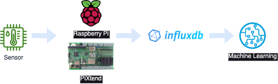
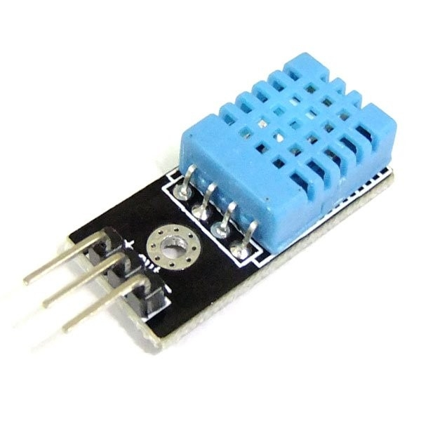
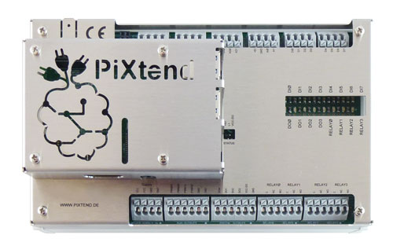
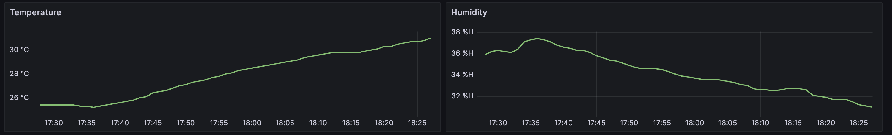
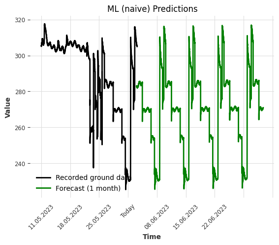

<!-- PROJECT LOGO -->
<br />
<div align="center">
  <a href="https://github.com/othneildrew/Best-README-Template">
    
  </a>

  <h3 align="center"> Ground-to-AI </h3>

  <p align="center">
    <b>Architecture to collect sensors data from ground and using it to train and develop artificial intelligence models.</b>
    
    ***** NOTE: This documentation is still being drafted *****
  </p>
</div>


<!-- TABLE OF CONTENTS -->
<details>
  <summary>Table of Contents</summary>
  <ol>
    <li>
      <a href="#about-the-project">About The Project</a>
      <ul>
        <li><a href="#built-with">Built With</a></li>
      </ul>
    </li>
    <li>
      <a href="#getting-started">Getting Started</a>
      <ul>
        <li><a href="#prerequisites">Prerequisites</a></li>
        <li><a href="#installation">Installation</a></li>
      </ul>
    </li>
    <li><a href="#usage">Usage</a></li>
    <li><a href="#license">License</a></li>
    <li><a href="#contact">Contact</a></li>
  </ol>
</details>


<!-- ABOUT THE PROJECT -->
## About The Project

<div align="center">
    
</div>

The aim of "Ground-to-AI" is to offer a simple and low-cost architecture that offer the way of collecting data in the field, transferring and transforming this data via a pipeline and analysing it using a Machine Learning model.


### Architecture

<div align="center">
    
</div>


#### Built With

- [DHT11 Temperature-Humidity Sensor](https://www.waveshare.com/temperature-humidity-sensor.htm)
- [PiXtend V2 Controller](https://www.pixtend.de/pixtend-v2/hardware-v2/pixtend-v2-l-controller/)
- [Raspberry Pi](https://www.raspberrypi.org/)
- [MariaDB](https://mariadb.com/)
- [InfluxDB OSS](https://www.influxdata.com/) & [InfluxDB Cloud](https://www.influxdata.com/products/influxdb-cloud/)
- [Grafana](https://grafana.com/)
- [Teltonika RUT240](https://teltonika-networks.com/de/products/routers/rut240)
- [Google Looker Studio](https://lookerstudio.google.com/u/0/)
- [Docker](https://docker.com/) & [Docker Hub](https://hub.docker.com/)
- [Azure Functions](https://learn.microsoft.com/en-us/azure/azure-functions/)
- [Python](https://docs.python.org/) & [Darts](https://unit8co.github.io/darts/index.html)


<!-- GETTING STARTED -->
## Getting Started

### Prerequisites

Things you need to have or do before you can install the architecture.

* A Raspberry Pi 4 Model B, 2GB RAM (others not tested) with the original Raspberry Pi OS or instead you can use a [PiXtend](https://www.pixtend.de)
	- Offical website : [https://www.raspberrypi.com/products/raspberry-pi-4-model-b](https://www.raspberrypi.com/products/raspberry-pi-4-model-b/)
	- Raspberry Pi Imager : [https://downloads.raspberrypi.org/imager](https://downloads.raspberrypi.org/imager/)
	- PiXtend V2 : [https://www.pixtend.de/start/quickstart-v2](https://www.pixtend.de/start/quickstart-v2/)
* A DHT11 [Temperature and Humidity Sensor](https://components101.com/sensors/dht11-temperature-sensor)
	- Hardware setup and Python library can be found here : [ https://www.raspberrypi-spy.co.uk/2017/09/dht11-temperature-and-humidity-sensor-raspberry-pi]( https://www.raspberrypi-spy.co.uk/2017/09/dht11-temperature-and-humidity-sensor-raspberry-pi/) 
* Create an account and a database on the Influx DB Cloud interface via [https://cloud2.influxdata.com/signup](https://cloud2.influxdata.com/signup)
* Create an account on the Azure Portal and then follow [this tutorial](https://learn.microsoft.com/en-us/azure/azure-functions/create-first-function-vs-code-python?pivots=python-mode-configuration) to create an *Azure Function*.


### Installations

#### Install Python on Raspberry Pi

```bash
wget https://www.python.org/ftp/python/3.11.3/Python-3.11.3.tgz
sudo tar zxf Python-3.11.3.tgz && cd Python-3.11.3
sudo ./configure --enable-optimizations
sudo make -j 4 && sudo make altinstall
source ~/.bashrc && sudo ln -s /usr/local/bin/python3.11 /usr/bin/python
```

#### Install Telegraf on Raspberry Pi

```bash
wget -q https://repos.influxdata.com/influxdata-archive_compat.key
echo '393e8779c89ac8d958f81f942f9ad7fb82a25e133faddaf92e15b16e6ac9ce4c influxdata-archive_compat.key' | sha256sum -c && cat influxdata-archive_compat.key | gpg --dearmor | sudo tee /etc/apt/trusted.gpg.d/influxdata-archive_compat.gpg > /dev/null
echo 'deb [signed-by=/etc/apt/trusted.gpg.d/influxdata-archive_compat.gpg] https://repos.influxdata.com/debian stable main' | sudo tee /etc/apt/sources.list.d/influxdata.list
sudo apt-get update && sudo apt-get install telegraf
sudo usermod -a -G video telegraf
```

```bash
sudo systemctl enable telegraf
sudo systemctl start telegraf
```

#### Install MariaDB on Raspberry Pi

```bash
sudo apt install mariadb-server
sudo pip install mysql-connector-python-rf
sudo mysql_secure_installation
```

#### Install InfluxDB on Raspberry Pi

```bash
wget https://dl.influxdata.com/influxdb/releases/influxdb2-2.7.0-linux-arm64.tar.gz
wget https://dl.influxdata.com/influxdb/releases/influxdb2-client-2.7.1-linux-arm64.tar.gz
tar xvfz influxdb2-2.7.0-linux-arm64.tar.gz
tar xvzf influxdb2-client-2.7.1-linux-arm64.tar.gz
sudo cp influxdb2_linux_arm64/influxd /usr/local/bin/
sudo cp influx /usr/local/bin/
sudo nano /etc/systemd/system/influxdb.service
sudo systemctl daemon-reload && sudo systemctl enable influxdb
sudo systemctl start influxdb
```

#### Install Grafana on Raspberry Pi

```bash
sudo apt-get install -y apt-transport-https
sudo apt-get install -y software-properties-common wget
sudo wget -q -O /usr/share/keyrings/grafana.key https://apt.grafana.com/gpg.key
echo "deb [signed-by=/usr/share/keyrings/grafana.key] https://apt.grafana.com stable main" | sudo tee -a /etc/apt/sources.list.d/grafana.list
sudo apt-get update && sudo apt-get install grafana
sudo systemctl enable grafana-server
sudo systemctl start grafana-server
```


### Configurations

```
This section must be completed
```

<!-- USAGE EXAMPLES -->
## Usage

For example, you can use this framework to collect data from a temperature sensor (connected to a [PiXtend](https://www.pixtend.de/)) and display it in Grafana. 

<div align="center">
    
    
    
</div>

Afterwards, the results of a model's predictions, executed on *Azure*, can then be obtained via a simple [Telegram](https://core.telegram.org/bots/api) notification.

<div align="center">
    
</div>

*Refer to the detailed script section below for more details.*

### Scripts

Scripts are organised into three categories and stored in the corresponding folders.

1. [Raspberry Pi](Raspberry%20Pi) : all the scripts run on the Raspberry Pi to manage interactions with physical elements.
2. [Configurations](Configurations) : the configuration files required for the various services.
3. [Azure](Azure) : all the scripts needed to deploy the Azure function enabling predictive maintenance to be carried out.

#### Raspberry Pi

- File [pixtend.py](Raspberry%20Pi/pixtend.py) : permanently executed on the « *PiXtend* » Raspberry. It is used to manage the control panel and the various PLCs needed to run the compressors, as well as logging related events. It is launched as soon as the Raspberry is booted by a superuser startup script configured via the « /etc/rc.local » file.
- File [event.py](Raspberry%20Pi/event.py) : permanently executed on the Master Raspberry Pi. It is used to check whether a new event has occurred on the installation. In this case, it is capable of triggering a call to an *Azure* function for predictive maintenance calculations.
- Folder [utils](Raspberry%20Pi/utils) : contains the functions needed for the main scripts to work properly. In particular, they can be used to establish a connection with the *MySQL* database, order relays, etc.

#### Configurations

- [downsample_climates_to_influxdb_cloud.json](Configurations/downsample_climates_to_influxdb_cloud.json) : Export of the replication task in *JSON* format and of the subsampling of the "*sensors*" bucket between the local *Influx* database and the *Influx Cloud* one.

#### Azure

- [requirements.txt](Azure/requirements.txt) which manages the dependencies of essential libraries, modules and packages.
- [Dockerfile](Azure/Dockerfile) document texte qui contient tous les appels nécessaires à l'assemblage de l'image de construction.
- [\_\_init\_\_.py](Azure/HttpTrigger/__init__.py) which stores the function code executed during a call via the Azure service. It is in this File that the ML model is defined and maintenance predictions are calculated.


<!-- LICENSE -->
## License

Distributed under the MIT License. See `LICENSE.txt` for more information.


<!-- CONTACT -->
## Contact

- [@weevood](https://github.com/weevood)
- Project Link: [https://github.com/weevood/Ground-to-AI](https://github.com/weevood/Ground-to-AI)
